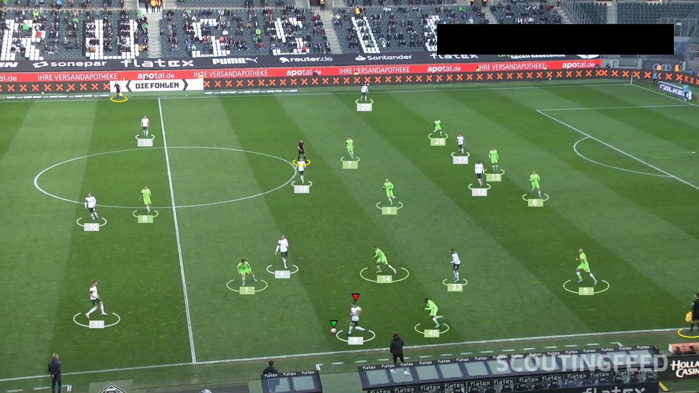

# Football Analysis Project

## Introduction
This project aimed to detect and track players, referees, and footballs in a video using YOLO, a state-of-the-art AI object detection model. I trained the model to enhance its performance and used Kmeans for pixel segmentation and clustering to assign players to teams based on their t-shirt colors. This information helped measure a team's ball possession percentage during a match. Additionally, I used optical flow to measure camera movement between frames, allowing accurate tracking of player movements. This project covered various concepts and addressed real-world problems, making it suitable challenge for showcasing my ML engineering capabilities.



## Modules Used
The following modules were used in this project:
- **YOLO**: AI object detection model
- **Kmeans**: Pixel segmentation and clustering to detect t-shirt color
- **Optical Flow**: Measure camera movement

## Trained Models
- I trained [YOLO v11 using the Ultralytics library](https://github.com/ultralytics/ultralytics). Download the weights of the fine-tuned model from this [link](https://drive.google.com/drive/folders/1SAaBir136HM6TuUksIgBABp4xgmRMVos?usp=sharing). Create a directory `models` then put the weight files into this directory.

## Sample Video
- A sample output video is located in the `output_videos` directory in both AVI and MP4 formats.

## Requirements
I used the `uv` tool for package management. You can use the files generated by `uv` to easily set up your environment.

To run this project, you need to have the following requirements installed:
- Python 3.x
- Ultralytics
- Supervision
- OpenCV
- NumPy

## Installation
To set up the environment using the `uv` tool, follow these steps:
1. Install `uv` by following the instructions on the [uv GitHub page](https://github.com/astral-sh/uv).
2. Navigate to the project directory.
3. Run the following command to install the dependencies:
```bash
uv sync
```

## Usage
To run the main script, use:
```bash
python main.py
```

This will process the input video, perform player and ball tracking, and save the output video in the specified format.

## Contributing
If you would like to contribute to this project, please fork the repository and submit a pull request.

## License
This project is licensed under the MIT License.